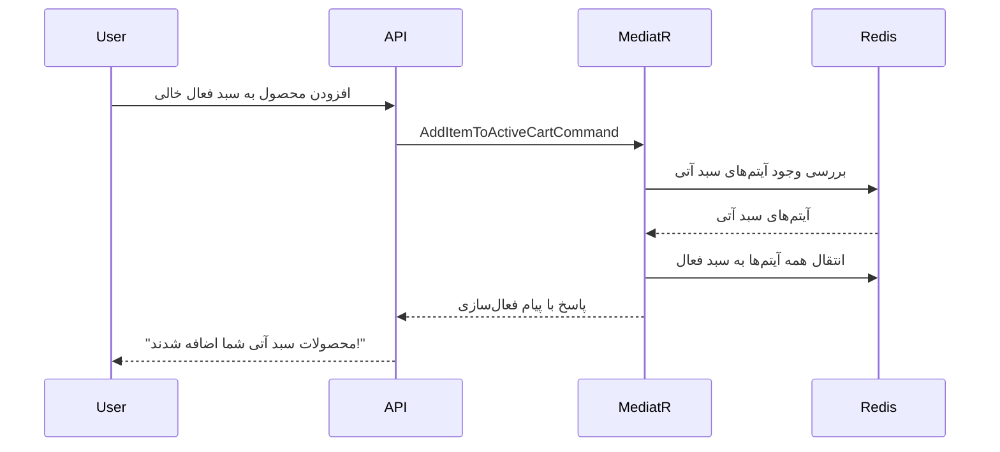
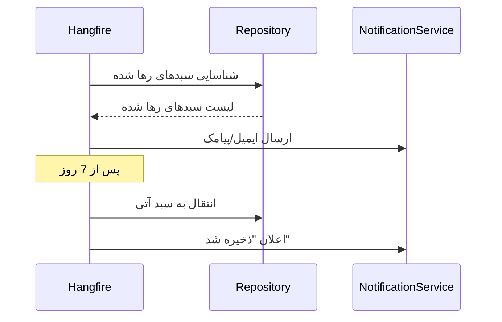

# 🛒 میکروسرویس سبد خرید دوگانه - راهکار جامع تجارت الکترونیک

## 📖 مقدمه

این پروژه یک میکروسرویس پیشرفته و حرفه‌ای برای مدیریت سبد خرید است که با استفاده از معماری Clean Architecture و الگوی CQRS طراحی شده است. این سرویس دو نوع سبد خرید را پشتیبانی می‌کند:
- **سبد خرید فعال**: برای خریدهای فعلی
- **سبد خرید آتی**: برای خریدهای آینده (بیش از یک لیست آرزو ساده)

## 🎯 ویژگی‌های کلیدی

### ✨ سیستم سبد خرید دوگانه

#### سبد خرید فعال (Active Cart)
- محل قرارگیری محصولاتی که کاربر قصد خرید فوری آن‌ها را دارد
- پشتیبانی از تمامی عملیات استاندارد (افزودن، حذف، ویرایش تعداد)
- قابلیت تبدیل به سفارش نهایی

#### سبد خرید آتی (Next-Time Purchase Cart)
- محل ذخیره محصولاتی که کاربر می‌خواهد در آینده خریداری کند
- قابلیت انتقال آسان محصولات بین دو سبد
- سیستم هوشمند فعال‌سازی خودکار

### 🤖 فعال‌سازی هوشمند سبد آتی

یکی از قابلیت‌های منحصر به فرد این سیستم، فعال‌سازی خودکار سبد آتی است:

1. **زمان فعال‌سازی**: زمانی که کاربری که محصولاتی در سبد آتی دارد، اولین محصول را به سبد فعال خالی اضافه می‌کند
2. **عملکرد**: تمامی محصولات سبد آتی به طور خودکار به سبد فعال منتقل می‌شوند
3. **اعلان فارسی**: "ما محصولاتی که برای خرید بعدی ذخیره کرده بودید را به سبد خریدتان اضافه کردیم!"
4. **قابلیت کنترل**: مدیران می‌توانند این قابلیت را فعال یا غیرفعال کنند

### 💫 موتور بازیابی سبدهای رها شده

سیستم پیشرفته بازیابی مشتریان شامل:

#### مرحله اول - تشخیص رهایی
- **آستانه زمانی**: 30 دقیقه (قابل تنظیم)
- **مانیتورینگ**: کنترل مداوم سبدهای فعال

#### مرحله دوم - اقدامات چندگانه
1. **ارسال ایمیل**: اعلان اولیه با پیشنهاد بازگشت
2. **ارسال پیامک**: یادآوری مکمل
3. **ارائه تخفیف**: ترغیب به تکمیل خرید

#### مرحله سوم - انتقال هوشمند (پس از 7 روز)
- انتقال محصولات به سبد آتی
- اعلان فارسی: "ما موارد سبد خرید شما را برایتان ذخیره کردیم تا بعداً به راحتی به آن‌ها دسترسی داشته باشید."

### ⚙️ پیکربندی پویا

مدیران سیستم می‌توانند تنظیمات زیر را به صورت زنده تغییر دهند:
- فعال/غیرفعال کردن فعال‌سازی خودکار سبد آتی
- تنظیم آستانه زمانی رهایی سبد
- تعداد و فاصله زمانی اعلان‌ها
- اعمال اعتبارسنجی‌های بلادرنگ

## 🏗️ معماری سیستم

### لایه‌های Clean Architecture

```
┌─────────────────────────────────────────┐
│                API Layer                │  ← RESTful Controllers
├─────────────────────────────────────────┤
│            Application Layer            │  ← CQRS + MediatR
├─────────────────────────────────────────┤
│           Infrastructure Layer          │  ← Redis, gRPC, Jobs
├─────────────────────────────────────────┤
│              Domain Layer               │  ← Entities, Events
└─────────────────────────────────────────┘
```

#### 1. لایه دامین (Cart.Domain)
- **موجودیت‌های اصلی**: `ShoppingCart`, `CartItem`
- **رویدادهای دامین**: `ItemAddedToCartEvent`, `NextPurchaseActivatedEvent`
- **تنظیمات و مقادیر**: `CartConfiguration`, `CartStatus`

#### 2. لایه اپلیکیشن (Cart.Application)
- **دستورات CQRS**: `AddItemToActiveCartCommand`, `MoveItemToNextPurchaseCommand`
- **کوئری‌ها**: `GetCartQuery`, `GetCartSummaryQuery`
- **هندلرهای MediatR**: هر دستور و کوئری هندلر اختصاصی دارد
- **DTOها**: `CartDto`, `CartItemDto`, `CartSummaryDto`

#### 3. لایه زیرساخت (Cart.Infrastructure)
- **مخزن Redis**: `RedisCartRepository` برای ذخیره‌سازی پرسرعت
- **کلاینت‌های gRPC**: ارتباط با سرویس‌های موجودی و کاتالوگ
- **کارهای پس‌زمینه**: Hangfire برای بازیابی سبدهای رها شده
- **انتشار رویداد**: RabbitMQ + MassTransit

#### 4. لایه API (Cart.API)
- **کنترلرهای RESTful**: `CartController`, `CartConfigurationController`
- **مستندسازی Swagger**: OpenAPI برای توسعه‌دهندگان
- **احراز هویت**: آماده برای JWT

## 🔧 فناوری‌های استفاده شده

### پلتفرم اصلی
- **.NET 8**: آخرین نسخه فریمورک با بهبودهای کارایی
- **C#**: زبان برنامه‌نویسی اصلی

### پایگاه داده
- **Redis**: ذخیره‌سازی پرسرعت سبدهای خرید به صورت JSON
- **PostgreSQL**: ذخیره‌سازی کارهای Hangfire

### ارتباطات
- **gRPC**: ارتباط سنکرون پرسرعت با سرویس‌های داخلی
- **RabbitMQ + MassTransit**: ارتباط ناهمگام مبتنی بر رویداد

### ابزارهای توسعه
- **MediatR**: پیاده‌سازی الگوی CQRS
- **Hangfire**: پردازش کارهای پس‌زمینه
- **Serilog**: لاگ‌گیری ساختاریافته
- **FluentValidation**: اعتبارسنجی درخواست‌ها
- **Swagger/OpenAPI**: مستندسازی API

### کانتینرسازی
- **Docker**: کانتینرسازی چندمرحله‌ای
- **Docker Compose**: ارکستراسیون سرویس‌ها

## 📊 مدل داده

### ساختار ذخیره‌سازی در Redis

```json
{
  "UserId": "user-123",
  "LastModifiedUtc": "2025-07-12T10:00:00Z",
  "ActiveItems": [
    {
      "ProductId": "prod-A",
      "Quantity": 2,
      "PriceAtTimeOfAddition": 50000,
      "ProductName": "گوشی هوشمند",
      "AddedUtc": "2025-07-12T09:30:00Z"
    }
  ],
  "NextPurchaseItems": [
    {
      "ProductId": "prod-B",
      "Quantity": 1,
      "PriceAtTimeOfAddition": 120000,
      "ProductName": "لپ تاپ",
      "AddedUtc": "2025-07-11T15:00:00Z"
    }
  ]
}
```

### کلید‌های Redis
- **سبد کاربر**: `cart:user:{userId}`
- **پیکربندی**: `cart:config:global`
- **آمار**: `cart:stats:{date}`

## 🌐 API Endpoints

### عملیات سبد خرید

#### دریافت سبد کامل
```http
GET /api/v1/carts
Authorization: Bearer {token}
```

#### افزودن محصول به سبد فعال
```http
POST /api/v1/carts/items
Content-Type: application/json

{
  "productId": "prod-123",
  "quantity": 2,
  "priceAtTimeOfAddition": 50000
}
```

#### انتقال محصول به سبد آتی
```http
POST /api/v1/carts/items/{productId}/move-to-next-purchase
```

#### فعال‌سازی دستی سبد آتی
```http
POST /api/v1/carts/activate-next-purchase
```

### مدیریت پیکربندی

#### دریافت تنظیمات
```http
GET /api/v1/admin/cart-config
Authorization: Bearer {admin-token}
```

#### تغییر تنظیمات فعال‌سازی خودکار
```http
PATCH /api/v1/admin/cart-config/auto-activate-next-purchase
Content-Type: application/json

{
  "enabled": true
}
```

## 🔄 جریان کاری سیستم

### سناریو 1: فعال‌سازی خودکار سبد آتی



### سناریو 2: بازیابی سبد رها شده



## ⚡ کارهای پس‌زمینه

### 1. پردازش سبدهای رها شده (هر 30 دقیقه)
```csharp
[DisableConcurrentExecution(timeoutInSeconds: 60)]
public async Task ProcessAbandonedCarts()
{
    // شناسایی سبدهای رها شده
    // ارسال اعلان‌ها
    // برنامه‌ریزی پیگیری‌ها
}
```

### 2. انتقال سبدهای قدیمی (روزانه ساعت 2 صبح)
```csharp
[DisableConcurrentExecution(timeoutInSeconds: 300)]
public async Task MoveAbandonedToNextPurchase()
{
    // انتقال آیتم‌های قدیمی به سبد آتی
    // ارسال اعلان "ذخیره شد"
}
```

### 3. پاکسازی سبدهای منقضی (هفتگی)
```csharp
public async Task CleanupExpiredCarts()
{
    // حذف سبدهای خیلی قدیمی
    // آزادسازی حافظه
}
```

## 🚀 راه‌اندازی و اجرا

### استفاده از Docker Compose (پیشنهادی)

```bash
# شروع تمامی سرویس‌ها
docker-compose up -d

# مشاهده لاگ‌ها
docker-compose logs -f cart-api

# توقف سرویس‌ها
docker-compose down
```

### توسعه محلی

```bash
# بازیابی پکیج‌ها
dotnet restore

# اجرای API
dotnet run --project CartService.API

# اجرا با watch (بارگذاری مجدد خودکار)
dotnet watch run --project CartService.API
```

### دسترسی به سرویس‌ها

- **Cart API**: https://localhost:5001
- **مستندات Swagger**: https://localhost:5001/swagger
- **داشبورد Hangfire**: https://localhost:5001/hangfire
- **مدیریت Redis**: http://localhost:8081
- **pgAdmin**: http://localhost:8080 (admin@example.com / admin)
- **مدیریت RabbitMQ**: http://localhost:15672 (guest / guest)

## 🧪 تست سیستم

### تست دستی با Swagger

1. به آدرس https://localhost:5001/swagger بروید
2. جریان کاری سبد دوگانه را تست کنید:
   - افزودن محصول به سبد فعال
   - انتقال محصول به سبد آتی
   - پاک کردن سبد فعال
   - افزودن محصول جدید (فعال‌سازی خودکار)

### سناریوهای تست

#### سناریو 1: فعال‌سازی خودکار
1. محصولی را به سبد آتی اضافه کنید
2. سبد فعال را پاک کنید
3. محصول جدیدی به سبد فعال اضافه کنید
4. بررسی کنید که محصولات سبد آتی خودکار منتقل شده‌اند
5. پیام فعال‌سازی را در پاسخ بررسی کنید

#### سناریو 2: بازیابی سبد رها شده
1. محصولاتی را به سبد فعال اضافه کنید
2. 30 دقیقه صبر کنید (یا آستانه را کاهش دهید)
3. داشبورد Hangfire را برای کارهای برنامه‌ریزی شده بررسی کنید
4. ارسال اعلان را در لاگ‌ها بررسی کنید

## 🔧 پیکربندی سیستم

### متغیرهای محیطی

```bash
# Redis
ConnectionStrings__Redis=localhost:6379

# Hangfire PostgreSQL
ConnectionStrings__Hangfire=Host=localhost;Database=cart_hangfire;Username=postgres;Password=password

# RabbitMQ
RabbitMQ__Host=localhost
RabbitMQ__Username=guest
RabbitMQ__Password=guest

# سرویس‌های gRPC
GrpcSettings__InventoryServiceUrl=https://localhost:7001
GrpcSettings__CatalogServiceUrl=https://localhost:7002
```

### تنظیمات پیش‌فرض

```json
{
  "CartConfiguration": {
    "AutoActivateNextPurchase": true,
    "AbandonmentThresholdMinutes": 30,
    "MoveToNextPurchaseAfterDays": 7,
    "MaxAbandonmentNotifications": 3,
    "NotificationIntervalHours": 24,
    "EnableRealTimeValidation": true
  }
}
```

## 📈 نظارت و مشاهده‌پذیری

### لاگ‌گیری ساختاریافته
```json
{
  "timestamp": "2025-07-12T10:30:00Z",
  "level": "Information",
  "messageTemplate": "Item {ProductId} moved to next-purchase cart for user {UserId}",
  "properties": {
    "ProductId": "prod-123",
    "UserId": "user-456",
    "CartOperation": "MoveToNextPurchase"
  }
}
```

### بررسی سلامت (Health Checks)
- **API**: `/health`
- **Redis**: `/health/redis`
- **Hangfire**: `/health/hangfire`
- **Dependencies**: `/health/dependencies`

### متریک‌ها
- تعداد عملیات سبد در دقیقه
- نرخ تبدیل سبد آتی
- موفقیت بازیابی سبدهای رها شده
- زمان پاسخ API

## 🔒 ملاحظات امنیتی

### اعتبارسنجی ورودی
```csharp
public class AddItemToCartCommandValidator : AbstractValidator<AddItemToCartCommand>
{
    public AddItemToCartCommandValidator()
    {
        RuleFor(x => x.ProductId).NotEmpty().MaximumLength(50);
        RuleFor(x => x.Quantity).GreaterThan(0).LessThanOrEqualTo(100);
        RuleFor(x => x.PriceAtTimeOfAddition).GreaterThan(0);
    }
}
```

### احراز هویت و مجوز
- پشتیبانی از JWT Token
- نقش‌های کاربری (User, Admin)
- محدودیت نرخ درخواست (Rate Limiting)

### حفاظت از کانتینر
- اجرا با کاربر غیر root
- حداقل دسترسی‌های لازم
- تصاویر امن بیس

## 🚀 بهینه‌سازی عملکرد

### ذخیره‌سازی Redis
- عملیات اتمیک برای به‌روزرسانی سبد
- فشرده‌سازی JSON
- TTL خودکار برای پاکسازی

### ارتباطات gRPC
- Connection pooling
- Deadline و timeout مناسب
- Retry policy هوشمند

### کارهای پس‌زمینه
- اجرای موازی محدود
- Queue‌های مجزا برای اولویت‌بندی
- مانیتورینگ در داشبورد Hangfire

## 🔮 توسعه‌های آتی

### قابلیت‌های برنامه‌ریزی شده
- اعلان‌های بلادرنگ با SignalR
- پیشنهاد محصولات با یادگیری ماشین
- پشتیبانی از چند ارز
- تحلیل‌های پیشرفته و گزارش‌گیری
- فریمورک A/B testing
- بین‌المللی‌سازی (i18n)

### بهبودهای معماری
- Event Sourcing برای تاریخچه تغییرات
- CQRS خوانش از Elasticsearch
- Microservices monitoring با Prometheus
- Distributed tracing با OpenTelemetry

## 🆘 عیب‌یابی

### مشکلات متداول

#### 1. اتصال Redis
```bash
# بررسی اتصال
redis-cli ping

# مشاهده کلیدهای سبد
redis-cli keys "cart:user:*"
```

#### 2. کارهای Hangfire
- داشبورد: https://localhost:5001/hangfire
- بررسی کارهای شکست خورده
- مشاهده لاگ‌های اجرا

#### 3. سرویس‌های gRPC
```bash
# تست اتصال Inventory Service
grpcurl -plaintext localhost:7001 list

# تست اتصال Catalog Service  
grpcurl -plaintext localhost:7002 list
```

### لاگ‌های مهم
```bash
# مشاهده لاگ‌های کانتینر
docker-compose logs -f cart-api

# فیلتر لاگ‌های خطا
docker-compose logs cart-api | grep ERROR

# مشاهده لاگ‌های عملیات سبد
docker-compose logs cart-api | grep CartOperation
```

## 📞 پشتیبانی و مستندات

### منابع اضافی
- [مستندات معماری (ARCHITECTURE.md)](./ARCHITECTURE.md)
- [راهنمای توسعه (DEVELOPMENT.md)](./DEVELOPMENT.md)
- [چک لیست نهایی (CHECKLIST.md)](./CHECKLIST.md)

### تماس با تیم توسعه
- Issues: استفاده از GitHub Issues
- مستندات API: Swagger UI
- مانیتورینگ: Hangfire Dashboard

---

**این مستندات آخرین به‌روزرسانی را در تاریخ ۲۱ تیر ۱۴۰۴ دریافت کرده است.**
