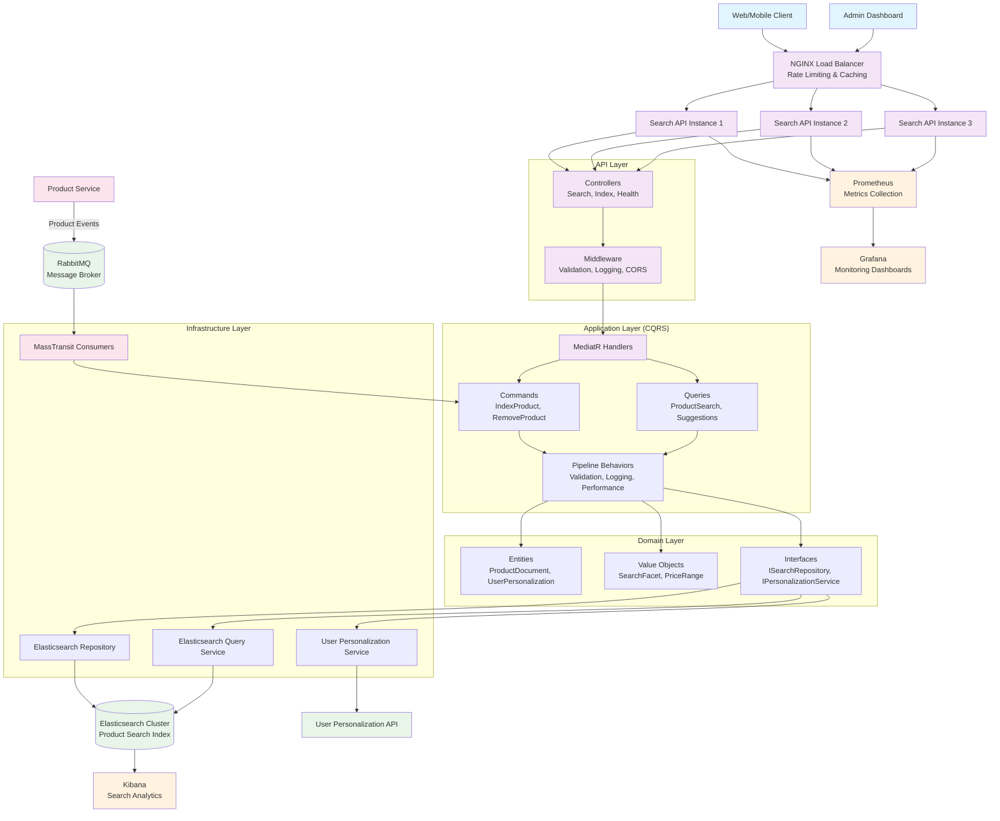
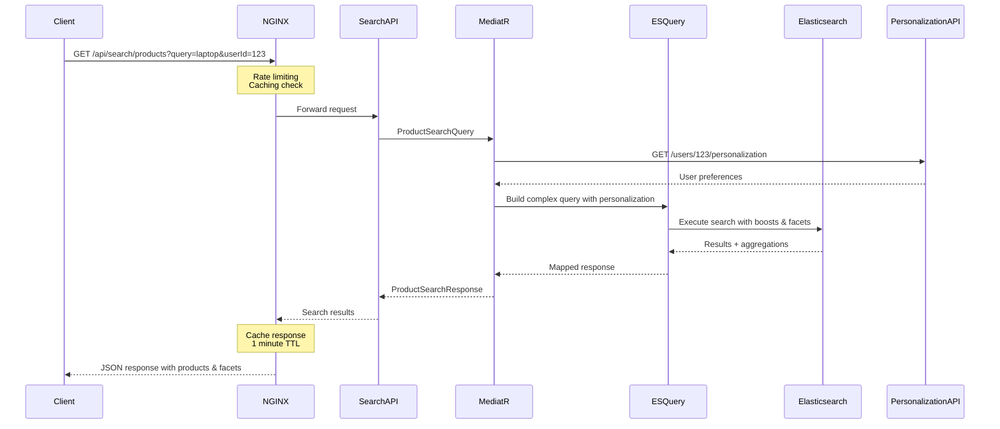
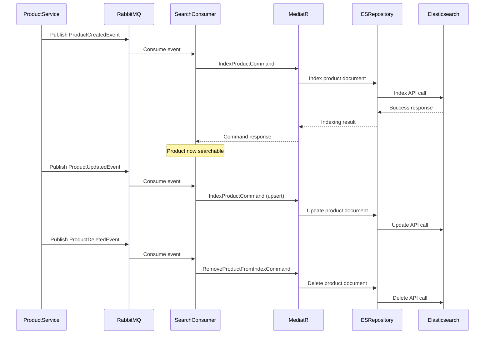
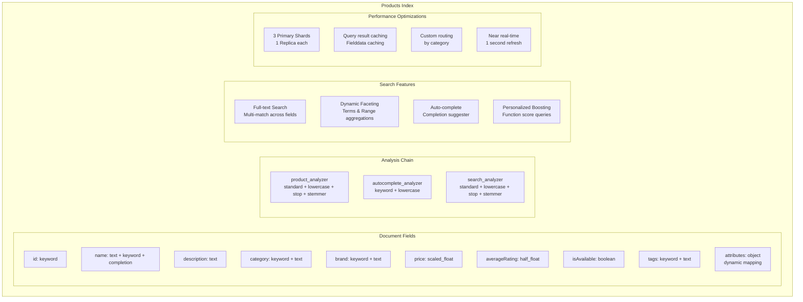
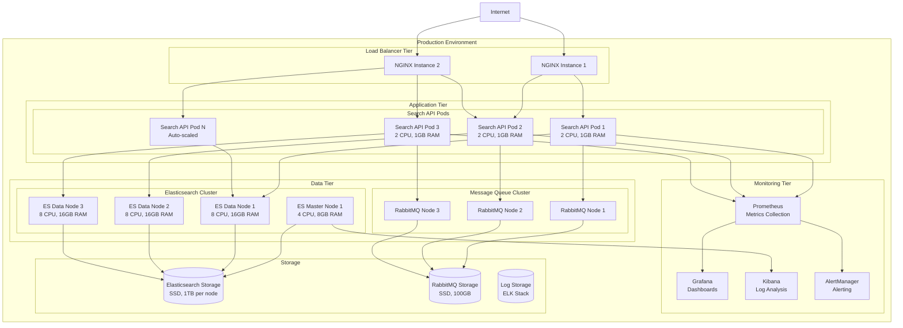

# Search Service Architecture

## System Architecture Flow

## Data Flow Diagram

## Event-Driven Index Updates

## Elasticsearch Index Structure

## Deployment Architecture

This architectural documentation provides:

1. **System Overview**: Complete flow from client request to response
2. **Data Flow**: Detailed sequence of search operations
3. **Event Processing**: How real-time updates work
4. **Index Structure**: Elasticsearch configuration and optimization
5. **Deployment**: Production-ready architecture with scaling considerations

The diagrams show how the Clean Architecture principles are maintained while achieving high performance and scalability through proper separation of concerns and infrastructure optimization.
