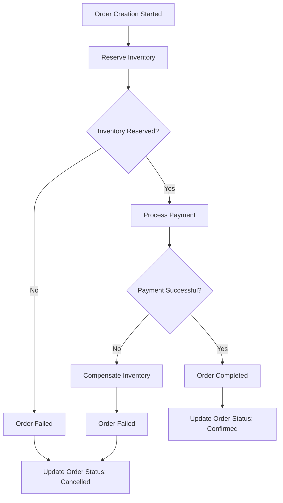

# Order Microservice

**میکروسرویس Order با معماری Clean Architecture، CQRS، و Saga Pattern**

## نمای کلی

این میکروسرویس برای مدیریت سفارشات با استفاده از بهترین practices و patterns طراحی شده است:

- **Clean Architecture** - جداسازی لایه‌ها و وابستگی‌ها
- **CQRS با MediatR** - جداسازی عملیات خواندن و نوشتن
- **Saga Pattern با MassTransit** - مدیریت workflow پیچیده
- **Event-Driven Architecture** - ارتباط async بین services

## معماری

```
├── OrderService.API/          # Presentation Layer
├── OrderService.Application/  # Application Layer (CQRS + Saga)
├── OrderService.Core/         # Domain Layer
└── OrderService.Infrastructure/ # Infrastructure Layer
```

## فناوری‌های استفاده شده

| فناوری | نسخه | هدف |
|---------|------|------|
| .NET | 8.0 | Runtime Framework |
| MediatR | 12.5.0 | CQRS Implementation |
| MassTransit | 8.2.0 | Saga Pattern & Messaging |
| RabbitMQ | 3.12 | Message Broker |
| PostgreSQL | 15 | Database |
| Entity Framework Core | 8.0 | ORM |
| FluentValidation | 11.9.0 | Input Validation |
| Serilog | 3.1.1 | Structured Logging |
| AutoMapper | 12.0.1 | Object Mapping |

## Commands & Queries

### Commands (نوشتن)
- **CreateOrderCommand** - ایجاد سفارش جدید
- **UpdateOrderStatusCommand** - تغییر وضعیت سفارش
- **CancelOrderCommand** - لغو سفارش

### Queries (خواندن)
- **GetOrderByIdQuery** - دریافت سفارش با ID
- **GetUserOrdersQuery** - دریافت سفارشات کاربر
- **GetDashboardOrdersQuery** - دریافت سفارشات برای داشبورد
- **GetDashboardOrdersQuery**: Admin query for order dashboard with filtering

## 🔄 Saga Pattern Implementation

### Order Creation Saga Workflow



### Saga States
- **InventoryReservation**: Waiting for inventory confirmation
- **PaymentProcessing**: Processing payment
- **OrderCompleted**: Successfully completed
- **OrderFailed**: Failed with compensation
- **Compensating**: Rolling back changes

### Activities
- **ReserveInventoryActivity**: Handles inventory reservation
- **PaymentActivities**: Processes payments
- **CompensationActivities**: Handles rollback operations

## 🚀 Key Features

### 1. **Eventual Consistency**
- Orders are created immediately with "Pending" status
- Saga orchestrates the complex workflow asynchronously
- Status updates are propagated through events

### 2. **Fault Tolerance**
- Compensation activities handle failures
- Automatic rollback of inventory reservations
- Payment refunds on order failures

### 3. **Scalability**
- Asynchronous processing with MassTransit
- Event-driven communication
- Separate read/write models (CQRS)

### 4. **Observability**
- Comprehensive logging with Serilog
- Saga state tracking
- Error handling and monitoring

## 📡 API Endpoints

### Order Management

```http
POST /api/order
# Creates new order and starts saga workflow

GET /api/order/{id}
# Gets order by ID

POST /api/order/{id}/cancel
# Requests order cancellation

PATCH /api/order/{id}/status
# Updates order status (admin/internal)
```

### Query Endpoints

```http
GET /api/order/user/{userId}?pageNumber=1&pageSize=10&sortBy=CreatedAt&sortAscending=false
# Gets user orders with pagination

GET /api/order/dashboard?pageNumber=1&pageSize=20&status=Pending&fromDate=2023-01-01&toDate=2023-12-31
# Gets dashboard orders with filtering
```

## 🛠️ Technology Stack

- **.NET 8**: Runtime and framework
- **MediatR**: CQRS implementation
- **MassTransit**: Saga orchestration and message bus
- **RabbitMQ**: Message broker
- **PostgreSQL**: Primary database
- **Entity Framework Core**: ORM
- **AutoMapper**: Object mapping
- **FluentValidation**: Input validation
- **Serilog**: Structured logging

## ⚙️ Configuration

### appsettings.json

```json
{
  "ConnectionStrings": {
    "OrderDbConnection": "Host=localhost;Port=5432;Database=OrderDb;Username=postgres;Password=123"
  },
  "RabbitMQ": {
    "Host": "localhost",
    "Username": "guest", 
    "Password": "guest",
    "Port": 5672
  }
}
```

## 🏃‍♂️ Getting Started

### Prerequisites
- .NET 8 SDK
- PostgreSQL
- RabbitMQ
- Docker (optional)

### Running the Service

1. **Clone the repository**
```bash
git clone <repository-url>
cd MicroService/src/services/order
```

2. **Restore packages**
```bash
dotnet restore
```

3. **Update database**
```bash
dotnet ef database update --project OrderService.Infrastructure
```

4. **Start RabbitMQ**
```bash
docker run -d --hostname my-rabbit --name some-rabbit -p 5672:5672 -p 15672:15672 rabbitmq:3-management
```

5. **Run the service**
```bash
dotnet run --project OrderService.API
```

## 📝 Example Usage

### Creating an Order

```json
POST /api/order
{
  "customerId": "123e4567-e89b-12d3-a456-426614174000",
  "totalPrice": 100.00,
  "totalDiscount": 10.00,
  "shippingAddress": "123 Main St, City, State 12345",
  "billingAddress": "123 Main St, City, State 12345",
  "items": [
    {
      "productId": "PROD001",
      "productName": "Sample Product",
      "quantity": 2,
      "unitPrice": 45.00,
      "discount": 5.00
    }
  ]
}
```

### Response
```json
{
  "id": "987fcdeb-51a2-43d7-8c5b-123456789abc",
  "customerId": "123e4567-e89b-12d3-a456-426614174000",
  "status": "Pending",
  "paymentStatus": "Pending",
  "totalAmount": 90.00,
  "createdAt": "2023-10-01T10:00:00Z"
}
```

## 🔧 Development Notes

### Extending the Saga
To add new steps to the order workflow:

1. Create new activities in `OrderService.Application/Activities/`
2. Add corresponding events in `OrderService.Application/Events/`
3. Update the `OrderSaga` state machine
4. Register new activities in `ConfigureServices.cs`

### Adding New Queries
1. Create query class implementing `IRequest<TResponse>`
2. Create corresponding handler implementing `IRequestHandler<TQuery, TResponse>`
3. Add validation rules in `OrderService.Application/Validators/`

### Error Handling
- All controllers have comprehensive try-catch blocks
- Saga activities include fault handling
- Compensation activities handle rollback scenarios

## 🏗️ Future Enhancements

- [ ] **Distributed Transaction Support**: Implement distributed transactions across multiple services
- [ ] **Event Sourcing**: Add event sourcing for complete audit trail
- [ ] **Read Model Optimization**: Implement separate read models for better query performance
- [ ] **Circuit Breaker**: Add circuit breaker pattern for external service calls
- [ ] **Metrics and Monitoring**: Integrate with Prometheus/Grafana
- [ ] **API Rate Limiting**: Implement rate limiting for API endpoints
- [ ] **Integration Tests**: Add comprehensive integration test suite

## 📄 License

This project is licensed under the MIT License - see the LICENSE file for details.

## 🤝 Contributing

1. Fork the repository
2. Create a feature branch
3. Commit your changes
4. Push to the branch
5. Create a Pull Request

---

**Built with ❤️ using Clean Architecture, CQRS, and Saga Pattern**
